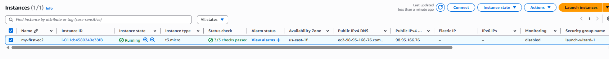
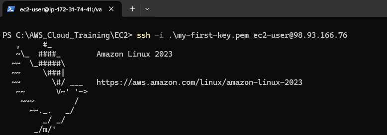
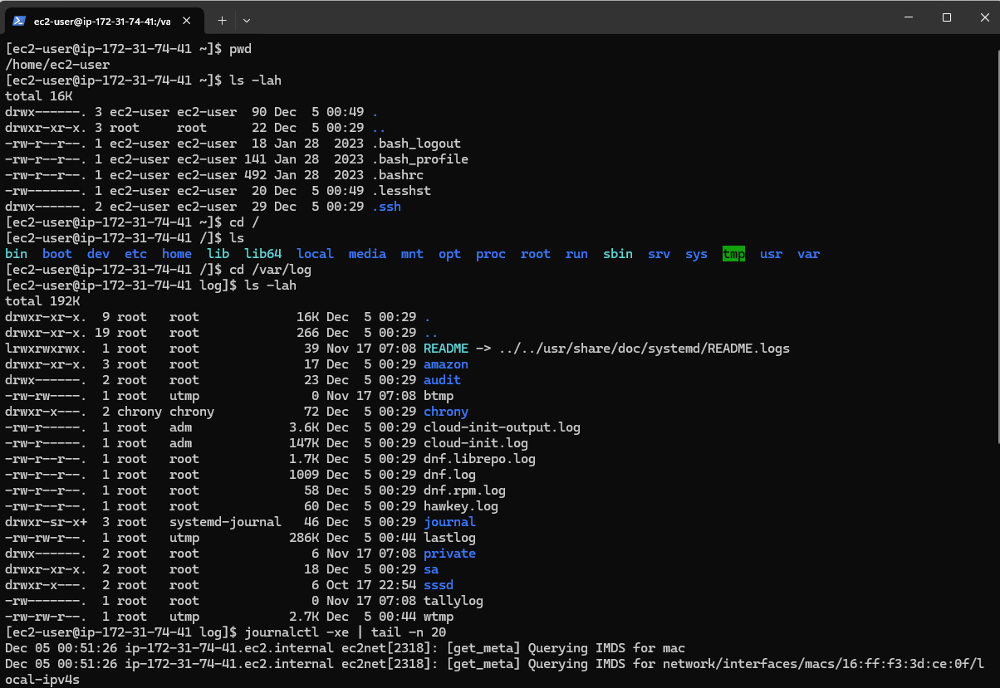
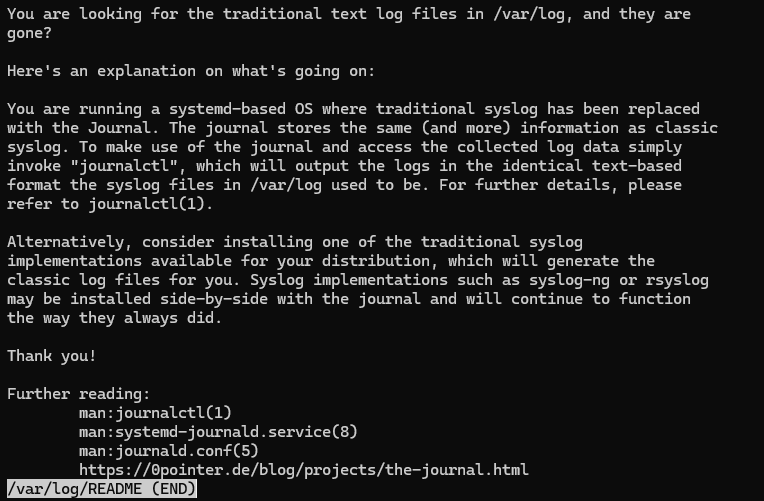

# Day 3 — My First EC2 Instance

## Instance Details
- **Region:** us-east-1
- **AMI:** Amazon Linux 2023 (Free Tier Eligible)
- **Instance** Type: t3.micro (Free Tier Eligible)
- **Security Group Rules:** Inbound SSH (TCP 22, 0.0.0.0/0)
- **Key Pair Name:** my-first-key

## Steps Taken
1. Logged into AWS Console.
2. Navigated to **EC2 Dashboard**.
3. Selected **Amazon Linux 2023 AMI**.
4. Chose **t3.micro** instance type.
5. Created a new key pair (**my-first-key**).
6. Created a new security group allowing  **SSH (port22)**.
7. Launched the instance and confirmed **Instance State = Running**.
8. Retrieved the instance **Public IPv4 Address**.

## SSH Connection
Command used to connect:
ssh -i my-first-key.pem ec2-user@98.93.166.76

## File System Exploration
Commands executed:
- `pwd`
- `ls -lah`
- `cd /`
- `ls`
- `cd /var/log`
- `ls -lah`
- `tail -n 20 messages`
- `journalctl -xe | tail -n 20`

Key directories explored:
- /var/log -- logs

## Screenshots

## Takeaways
- Learned how to launch and connect to an EC2 instance.
- Gained initial exposure to Linux directory structure.
- Understood how AWS compute resources are configured and secured.
- Practiced essential SSH and filesystem commands.
