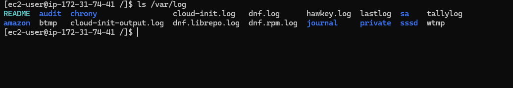
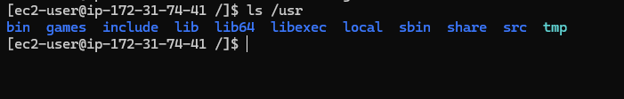

# Day 3 — Linux Filesystem Exploration

## 🧭 Commands Practiced
- `pwd` — show current directory
- `ls -lah` — list files with detailed metadata and human-readable sizes
- `cd /` — move to filesystem root
- `cd /var/log` — navigate to system logs
- `tail -n 20 messages` — view last 20 log entries
- `nano notes.txt` — practice editing files in the terminal

---

## 📁 Directories Explored
### `/etc`
Contains system-wide configuration files  
Examples:
- network config  
- service definitions  
- user/group settings  

### `/var/log`
Stores application and system logs  
Examples:
- `messages`
- `secure`
- `dmesg`

### `/usr`
Holds user-installed programs, binaries, and libraries  
Often the largest directory

---

## 📝 Notes Learned
- Linux organizes everything into a **single directory tree**, starting at `/`
- `/etc` contains configuration files (never executable binaries)
- `/var/log` is essential for debugging system issues
- `tail` and `journalctl` help monitor real-time log activity
- `nano` is useful for lightweight text editing over SSH
- Permissions determine what you can modify or read in the filesystem

---

## 🖼️ Screenshots

---

## 🎯 Takeaways
- Learned how to navigate core Linux directories
- Understood where logs and configs live  
- Practiced using common CLI tools (`ls`, `cd`, `tail`, `nano`)
- Became more comfortable moving around a Linux system over SSH
