# Day 4 — IAM Hands-On Exercises

Today’s focus: IAM users, groups, roles, MFA, and permissions validation.  
All exercises were performed in my own AWS account, following least-privilege principles.

---

## 1. IAM Group — `devops-students`

This group was created to follow least-privilege practices.  
It grants **AmazonS3ReadOnlyAccess**, meaning any user added to this group can read S3 buckets but **cannot** modify or create them.

**Screenshot — Group Overview**  
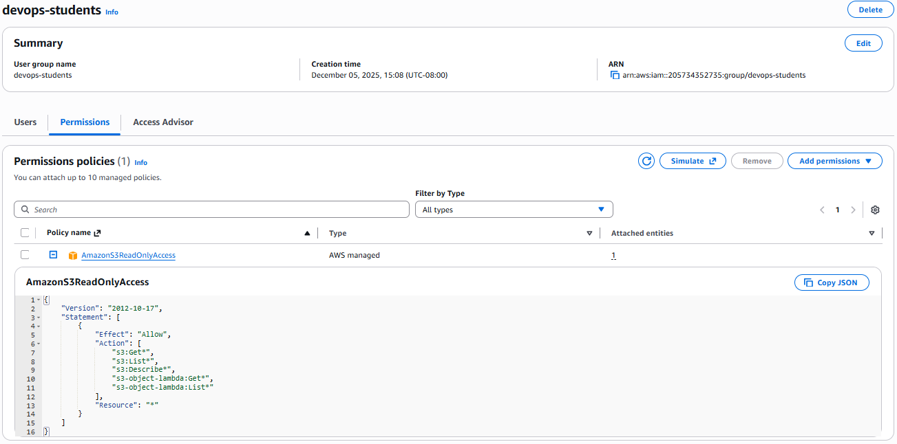

**Screenshot — Users in Group**  
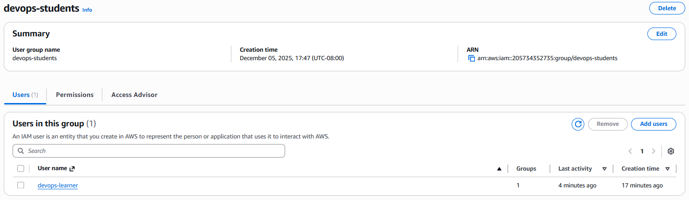

---

## 2. IAM User — `devops-learner`

The IAM user was created with console access and a forced password reset on first sign-in.  
This user inherits S3 read-only permissions from the `devops-students` group.

**Screenshot — User Overview**  
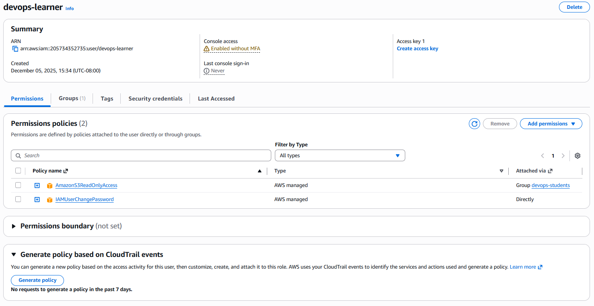

**Screenshot — User Group Association**  
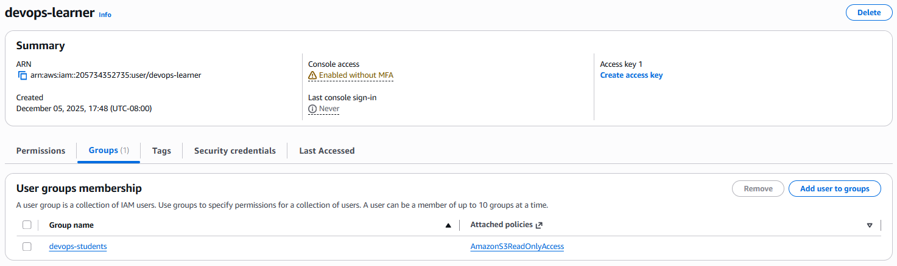

**Screenshot — User Permissions Summary**  
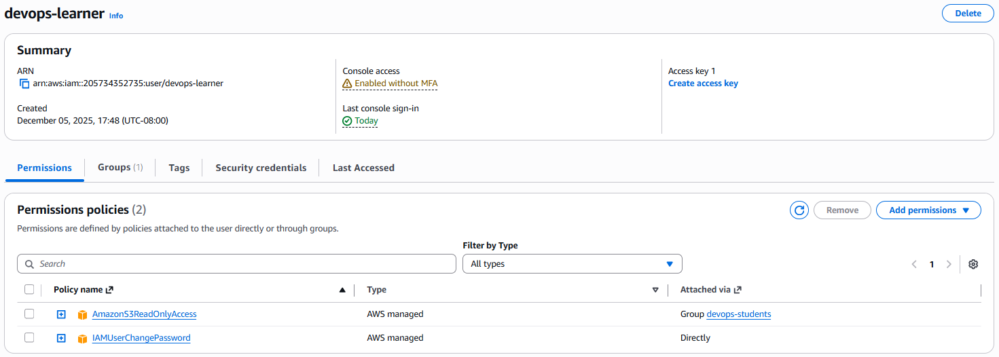

---

## 3. MFA Configuration

A virtual MFA device was assigned to the user to improve authentication security.

**Screenshot — User with MFA Enabled**  
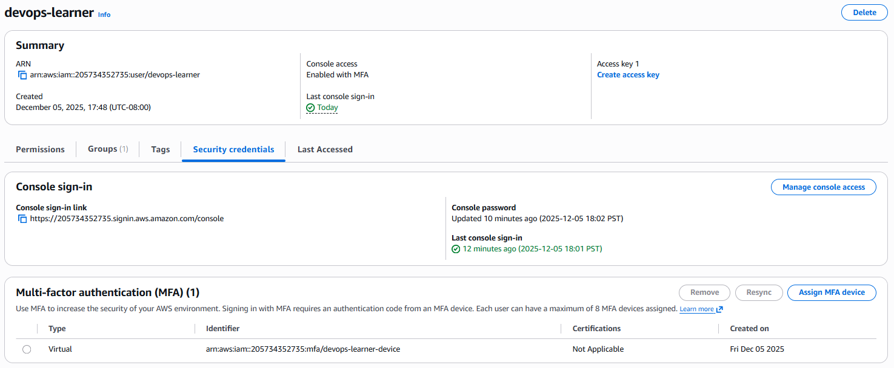

---

## 4. IAM Role — `EC2_ReadOnly_Role`

This role allows EC2 instances to assume it in order to perform **read-only** EC2 actions.  
AWS Managed Policy attached: **AmazonEC2ReadOnlyAccess**

**Screenshot — Role Permissions**  
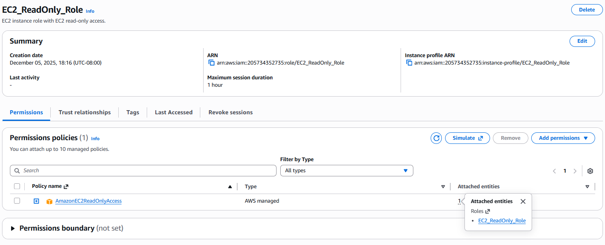

**Screenshot — Role Trust Policy**  
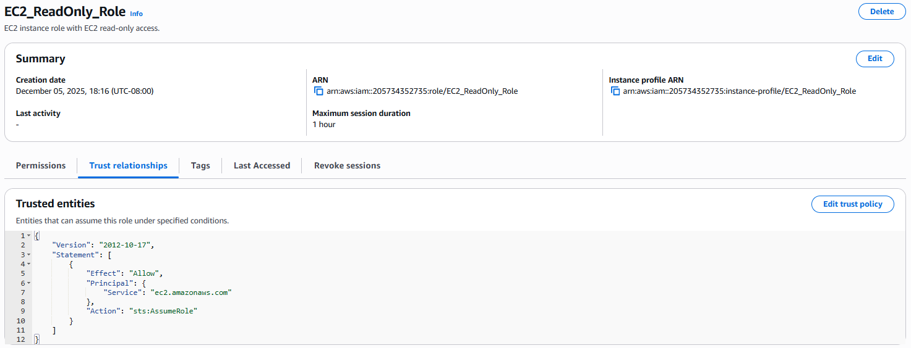

A copy of the trust policy JSON is saved in:  
./day4/ec2-readonly-trust-policy.json

---

## 5. Permission Tests — Using the AWS IAM Policy Simulator

I used the Policy Simulator to verify what `devops-learner` can and cannot do.  
Here are the results captured during testing:

### ✔ Allowed
- **s3:ListBuckets** → Allowed (as expected)

**Screenshot — Read S3 Success**  
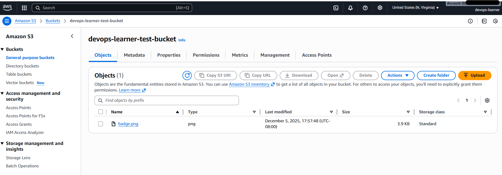

### ❌ Denied (as expected)
- **ec2:DescribeInstances** → Denied  
  (User has no EC2 permissions)

**Screenshot — EC2 Access Denied**  
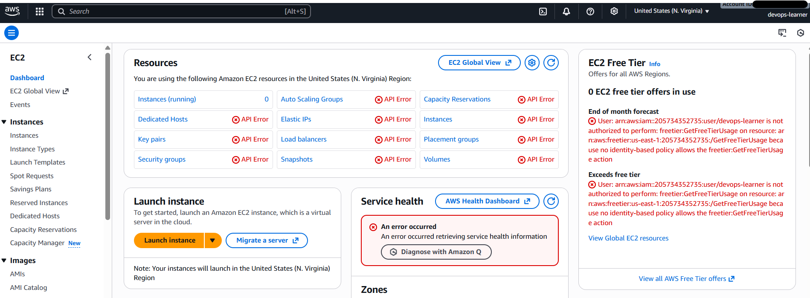

- **iam:CreateUser** → Denied  
  (Least privilege principle working correctly)

**Screenshot — User Creates Bucket Fails (as expected)**  
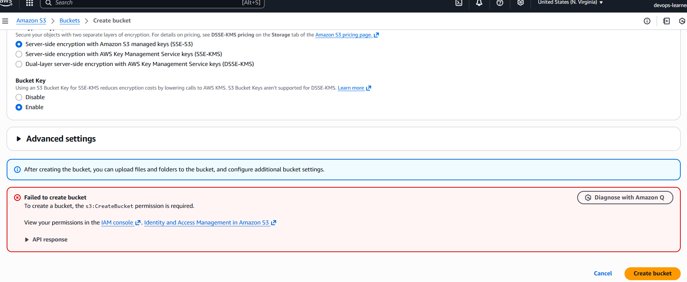

- **vpc:Dashboard** → Denied  
  (User cannot interact with VPC)

**Screenshot — VPC Access Denied**  
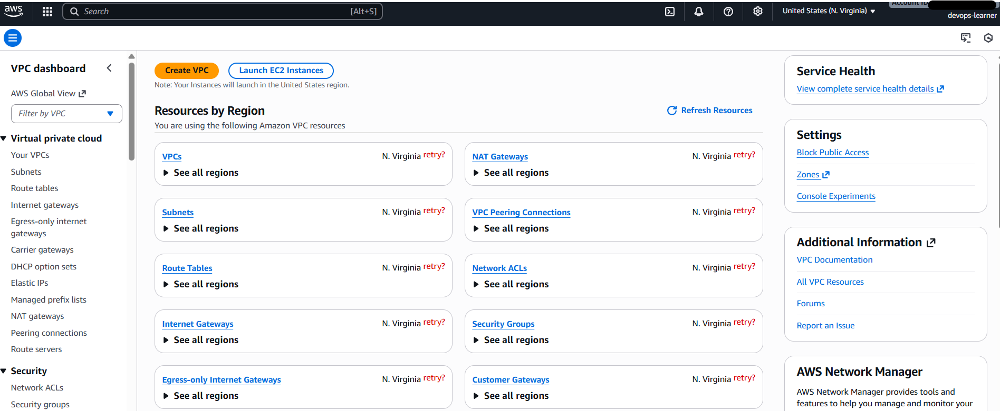

- **s3:PutObject (Upload)** → Denied  
  (Read-only access prevents uploads)

**Screenshot — Object Upload Denied**  
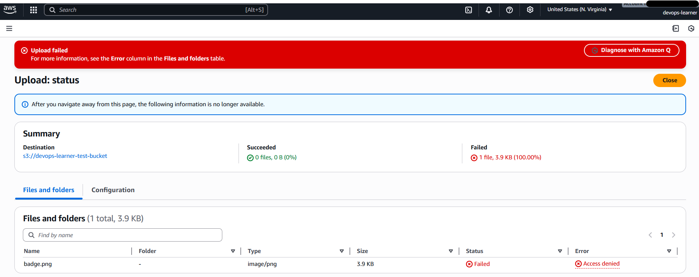

**Screenshot — Policy Simulator Overview**  
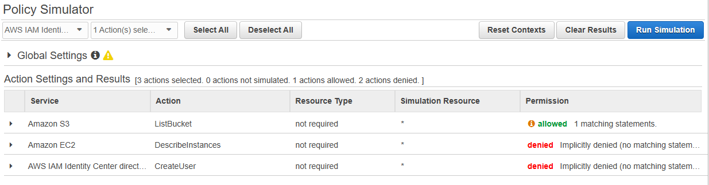

---

## 6. Key Takeaways

- IAM Groups simplify user permission management and enforce consistent privileges.
- MFA dramatically improves account security and is required for best practices.
- IAM Roles differ from IAM Users — roles are assumed by AWS services, not humans.
- The Policy Simulator is invaluable for **testing permissions safely** before using real AWS resources.
- Least privilege is working correctly — user can **read** S3 but cannot:
  - create buckets  
  - upload objects  
  - describe EC2 instances  
  - create IAM users  
  - interact with VPC  
- This exercise provides a foundational understanding of AWS identity management.

---

